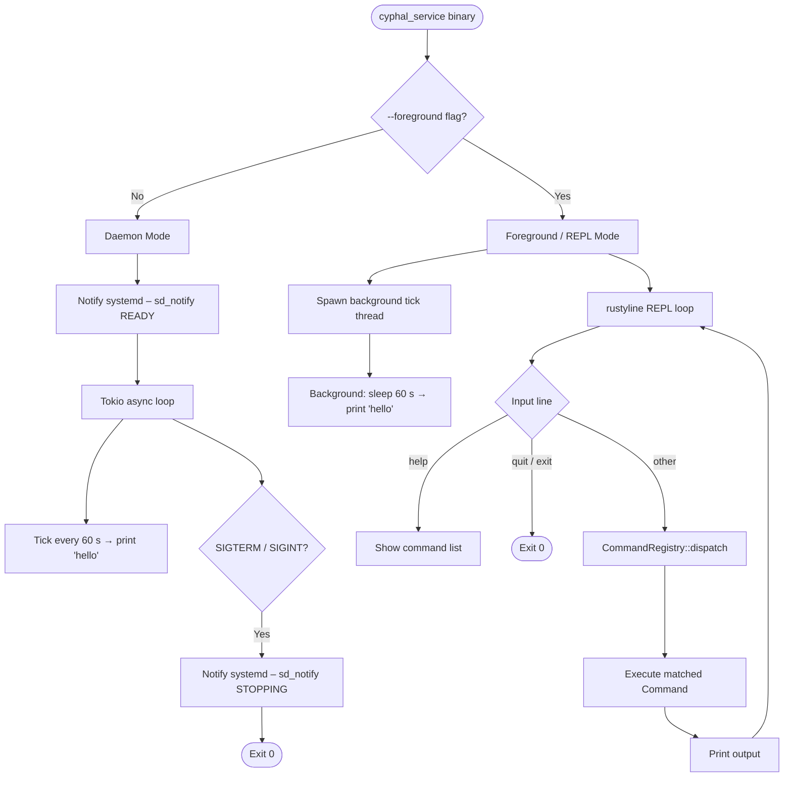
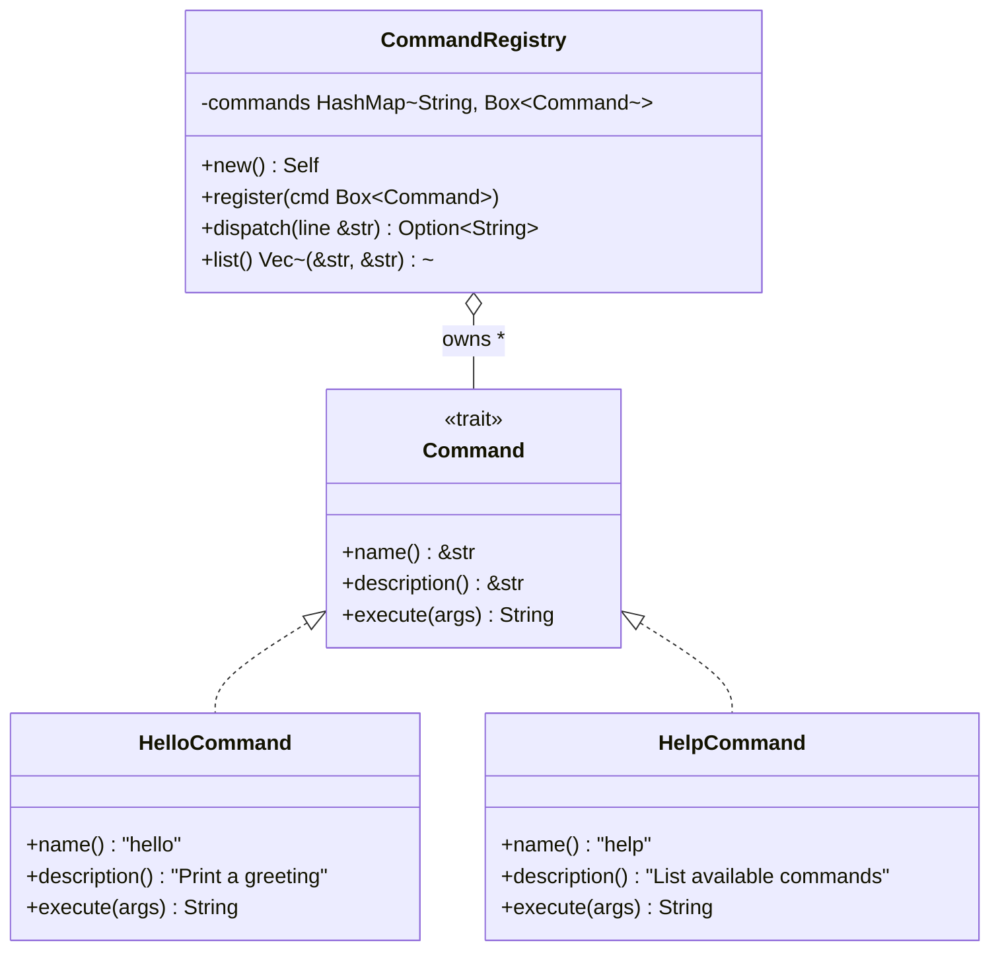
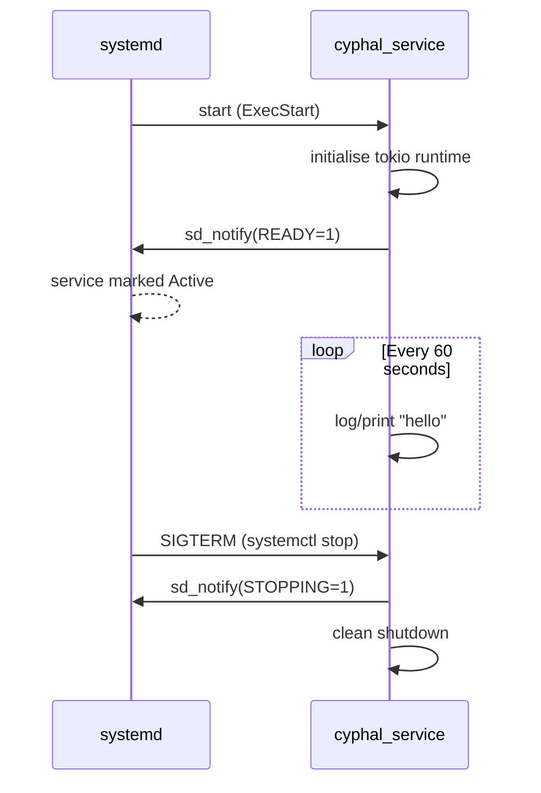

# cyphal_service

[](https://github.com/daveismith/cyphal_service/actions/workflows/ci.yml)

A Rust-based Linux service designed to run as a **systemd daemon**, with a
built-in **foreground REPL** mode for interactive use or development on any
host.

---

## Overview



### Command registry

Commands are registered at startup and dispatched by name.  Adding a new
command requires only implementing the `Command` trait and calling
`registry.register(…)`.



---

## Features

- **Systemd daemon** (`Type=notify`) – notifies systemd on ready and stopping.
- **Foreground REPL** – interactive readline prompt, command history.
- **Pluggable command architecture** – register new commands without touching
  existing code.
- **Cyphal/CAN** – SocketCAN (Linux) and gs_usb/candleLight USB (all platforms).
- **Cyphal/UDP** – all platforms.
- **Cyphal/Serial** – all platforms.
- **macOS support** – foreground/REPL mode works on macOS; CAN via gs_usb.
- **Graceful shutdown** – handles `SIGTERM` and `SIGINT`.
- **Configurable log level** via `RUST_LOG` environment variable.

---

## Installation (Ubuntu 24.04 LTS)

### 1 – Download the release tarball

```bash
VERSION="v0.1.0"   # replace with the desired release tag
curl -Lo "cyphal_service-${VERSION}-x86_64-linux.tar.gz" \
    "https://github.com/daveismith/cyphal_service/releases/download/${VERSION}/cyphal_service-${VERSION}-x86_64-linux.tar.gz"

tar -xzf "cyphal_service-${VERSION}-x86_64-linux.tar.gz"
cd "cyphal_service"
```

### 2 – Create the `cyphal` user

The service should **not** run as root.  Create a dedicated system user:

```bash
sudo useradd \
    --system \
    --no-create-home \
    --shell /usr/sbin/nologin \
    --comment "Cyphal service account" \
    cyphal
```

### 3 – Run the install script

```bash
chmod +x install.sh
sudo ./install.sh
```

The script copies the binary to `/usr/local/bin/`, installs the systemd unit,
reloads the daemon and enables the service.

### 4 – Start the service

```bash
sudo systemctl start cyphal_service
sudo systemctl status cyphal_service
```

### 5 – View logs

```bash
journalctl -u cyphal_service -f
```

---

## Building from source

### Prerequisites

- Rust stable (≥ 1.85) – install via [rustup](https://rustup.rs/)

```bash
cargo build --release
```

The binary will be at `target/release/cyphal_service`.

---

## Usage

```
Cyphal Linux Service

Usage: cyphal_service [OPTIONS]

Options:
  -f, --foreground       Run in foreground with an interactive REPL instead of daemonising
  -c, --config <FILE>    Path to a TOML configuration file for Cyphal transports
  -h, --help             Print help
  -V, --version          Print version
```

### Daemon mode (default)

```bash
./cyphal_service
# With transports:
./cyphal_service --config /etc/cyphal/cyphal.toml
```

Outputs `hello` to stdout (captured by journald when running as a service)
once per minute.  Exit with `SIGTERM` or `Ctrl-C`.

### Foreground / REPL mode

```bash
./cyphal_service --foreground
# With transports:
./cyphal_service --foreground --config ~/cyphal.toml
```

```
cyphal_service – foreground mode
Type 'help' for available commands, 'quit' or 'exit' to stop.
cyphal> help
Available commands:
  get-info         Query a node's GetInfo. Usage: get-info <transport> <node-id>
  hello            Print a greeting
  help             List available commands
  nodes            List Cyphal nodes observed on transports. Usage: nodes [<transport>]
cyphal> nodes
Transport: udp-primary
  Node ID  Uptime(s)  Health     Mode
  42       15         0          0
cyphal> get-info udp-primary 42
Node 42  (org.example.my_device)
Hardware : 1.0
Software : 2.3
Unique ID: 01:02:03:04:05:06:07:08:09:0a:0b:0c:0d:0e:0f:10
cyphal> quit
Goodbye.
```

`nodes` now includes the local transport node immediately after startup. This
does not depend on heartbeat loopback support from the underlying transport or
USB adapter, so repeated foreground runs should still show the service's own
node ID.

---

## Running as a systemd service

The unit file at `config/cyphal_service.service` is installed to
`/lib/systemd/system/` by the install script.

### Key unit file settings

| Setting | Value | Purpose |
|---------|-------|---------|
| `Type` | `notify` | Waits for `sd_notify(READY=1)` before marking active |
| `User` / `Group` | `cyphal` | Runs without root privileges |
| `Restart` | `on-failure` | Automatically restart on unexpected exit |
| `NoNewPrivileges` | `yes` | Security hardening |
| `ProtectSystem` | `strict` | Read-only filesystem view |

### Service lifecycle



---

## Cyphal transport configuration

Transports are configured via a TOML file passed with `--config`.  A commented
example is at [`config/cyphal.toml.example`](config/cyphal.toml.example).

```toml
# CAN via gs_usb / candleLight USB (all platforms)
[[transport]]
type     = "can"
name     = "can-usb"
driver   = "gsusb"
node_id  = 42
bitrate  = 1000000  # must match the live CAN bus bitrate exactly

# CAN via Linux SocketCAN (Linux only)
[[transport]]
type      = "can"
name      = "can0"
driver    = "socketcan"
node_id   = 43
interface = "can0"

# Cyphal/UDP
[[transport]]
type      = "udp"
name      = "udp-primary"
node_id   = 100
interface = "192.168.1.50"

# Cyphal/Serial
[[transport]]
type      = "serial"
name      = "serial-primary"
node_id   = 200
port      = "/dev/ttyUSB0"
baud_rate = 115200
```

---

## macOS quick-start

CAN on macOS requires a candleLight-compatible USB adapter (CANable, Canable-M,
etc.) and the `libusb` library:

```bash
# 1. Install libusb
brew install libusb

# 2. Create a config file
cat > ~/cyphal.toml << 'EOF'
[[transport]]
type    = "can"
name    = "can-usb"
driver  = "gsusb"
node_id = 42
bitrate = 1000000
EOF

# 3. Start in foreground mode
cargo run -- --foreground --config ~/cyphal.toml
```

When the service starts, `nodes` should show the configured local node even if
there are no other nodes on the bus yet:

```text
cyphal> nodes
Transport: can-usb
    Node ID  Uptime(s)  Health     Mode
    42       0          0          0
```

> **Note (Linux):** The `gs_usb` kernel module and the `gsusb` driver
> conflict.  Before using `driver = "gsusb"`, unload the module:
> `sudo rmmod gs_usb`

> **Note (macOS):** If a KEXT from another USB CAN tool is loaded, unload it
> before running cyphal_service.

> **Note (bus visibility):** Remote nodes such as node `125` will only appear
> if the configured `bitrate` matches the actual CAN bus bitrate. A healthy
> local `can-usb` node with no remote nodes listed usually means either there
> is no traffic on the bus yet, or the adapter is listening at the wrong rate.

> **Note (tool handoff):** `cyphal_service` now resets the gs_usb channel and
> clears stalled bulk endpoints on startup and shutdown so it can recover more
> reliably after other CAN tools have used the adapter. If another tool still
> keeps the device claimed or leaves the adapter wedged, unplugging and
> reconnecting the USB adapter is still the final fallback.

---

---

## Extending with new commands

1. Create `src/commands/<name>.rs` implementing the `Command` trait:

   ```rust
   use crate::commands::Command;

   pub struct MyCommand;

   impl Command for MyCommand {
       fn name(&self) -> &'static str { "my-cmd" }
       fn description(&self) -> &'static str { "Does something useful" }
       fn execute(&self, args: &[&str]) -> String {
           format!("received args: {:?}", args)
       }
   }
   ```

2. Add `pub mod <name>;` to `src/commands/mod.rs`.

3. Register in `src/cli.rs` → `register_defaults`:

   ```rust
   registry.register(Box::new(MyCommand));
   ```

4. Add unit tests and ensure `cargo fmt`, `cargo clippy`, and `cargo test` all pass.

---

## Development

```bash
# Format
cargo fmt --all

# Lint
cargo clippy --all-targets --all-features -- -D warnings

# Test
cargo test --all-targets
```

> All three must pass with no errors or warnings before a change may be
> considered complete.

---

## License

MIT
